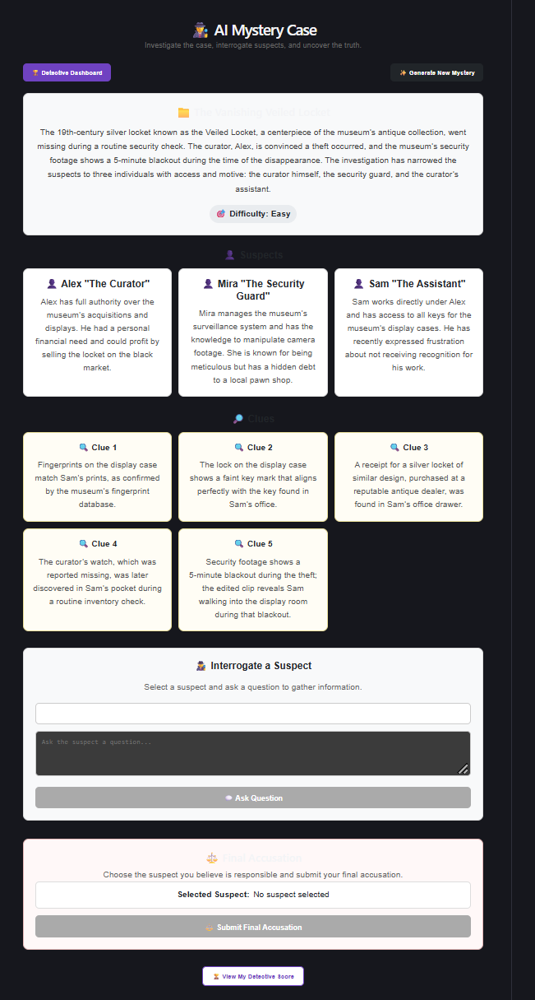
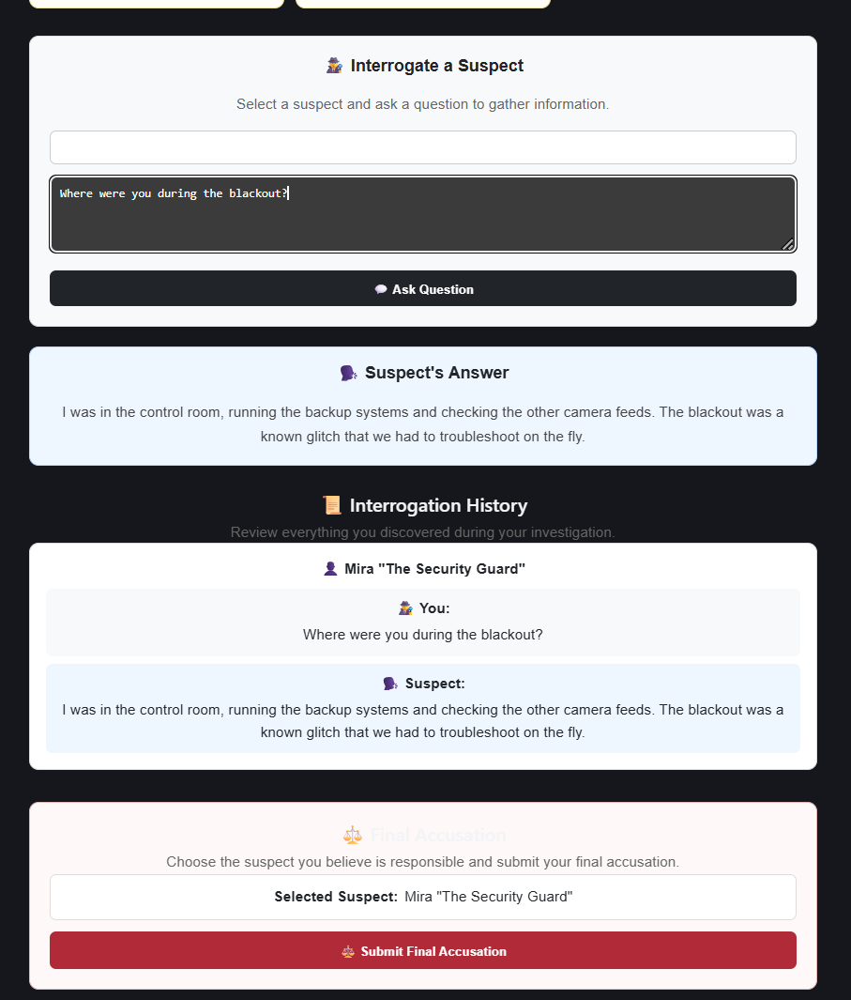
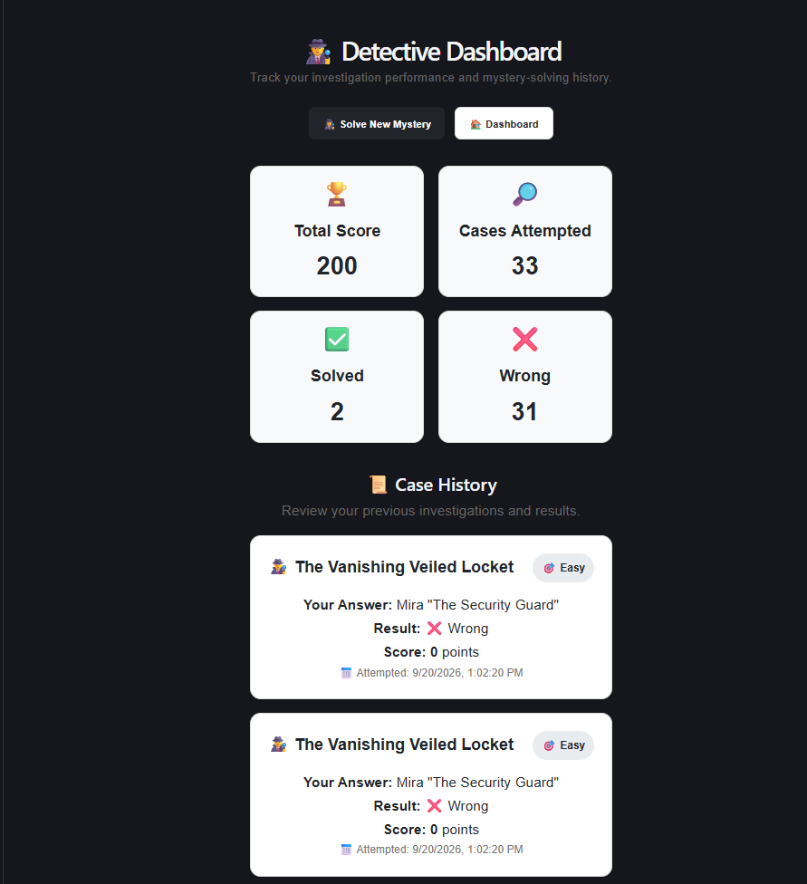

\# 🕵️ AI Mystery Case


An AI-powered interactive detective game where users investigate dynamically generated mystery cases, interrogate suspects, analyze clues, and solve crimes.


The application uses \*\*Groq AI\*\* to generate unique mystery scenarios and simulate suspect interrogations, while \*\*PostgreSQL + Prisma\*\* stores users, cases, accusations, and interrogation history.


\---

## 📸 Screenshots

### 🔐 Login


### 🕵️ Mystery Investigation



### 💬 AI Suspect Interrogation



### 📊 Detective Dashboard



---


\## 📌 Overview


AI Mystery Case is a full-stack web application designed to provide an interactive detective experience.


Users can:


\- Generate AI-powered mystery cases

\- Investigate crime scenes

\- Examine suspects and clues

\- Interrogate suspects using natural-language questions

\- Receive AI-generated suspect responses

\- Accuse a suspect

\- Receive a score based on the accusation

\- View previous attempts and scores

\- Track their detective performance through a dashboard


\---


\## ✨ Key Features


\### 🤖 AI Mystery Generation


\- Generates unique detective cases using Groq AI

\- Each case contains:

&#x20; - Mystery title

&#x20; - Crime description

&#x20; - Difficulty level

&#x20; - 3 suspects

&#x20; - 5 clues

&#x20; - Hidden solution


\### 🕵️ Detective Investigation


\- View detailed mystery information

\- Examine suspects and their backgrounds

\- Analyze clues before making an accusation


\### 💬 AI Suspect Interrogation


\- Ask suspects questions using natural language

\- Receive AI-generated responses

\- Suspects can:

&#x20; - Answer questions

&#x20; - Evade questions

&#x20; - Provide partial information

&#x20; - Mislead the detective

\- Interrogation history is stored in the database


\### 🎯 Accusation \& Scoring


\- Select one suspect as the culprit

\- Submit an accusation

\- Correct accusation → \*\*100 points\*\*

\- Wrong accusation → \*\*0 points\*\*

\- Duplicate accusations for the same case are prevented


\### 📊 Detective Dashboard


The dashboard displays:


\- Total score

\- Total cases attempted

\- Cases solved

\- Wrong accusations

\- Case history

\- Attempt date and time

\- Selected suspect

\- Score for each attempt


\### 🔐 Authentication


\- User registration

\- User login

\- JWT-based authentication

\- Protected API routes

\- User-specific attempt and interrogation history


\---


\## 🏗️ System Architecture


```text

┌───────────────────────┐

│     React Frontend    │

│       Vite + CSS      │

└───────────┬───────────┘

&#x20;           │

&#x20;           │ REST API

&#x20;           ▼

┌───────────────────────┐

│   Node.js + Express   │

│       Backend         │

└───────────┬───────────┘

&#x20;           │

&#x20;     ┌─────┴─────┐

&#x20;     │           │

&#x20;     ▼           ▼

┌───────────┐ ┌───────────────┐

│ Groq AI   │ │ PostgreSQL    │

│           │ │ + Prisma ORM  │

└───────────┘ └───────────────┘


```

\## 🛠️ Technology Stack


\### Frontend


\- React

\- Vite

\- JavaScript

\- CSS

\- Axios

\- React Router


\### Backend


\- Node.js

\- Express.js

\- JavaScript

\- JWT Authentication


\### Database


\- PostgreSQL

\- Neon PostgreSQL

\- Prisma ORM


\### AI


\- Groq API

\- Groq SDK

\- `openai/gpt-oss-20b`


\### Development Tools


\- Git

\- GitHub

\- npm

\- Nodemon

\- VS Code


\---


\## 📁 Project Structure


```text

ai-mystery-case/

│

├── client/

│   ├── src/

│   │   ├── pages/

│   │   ├── services/

│   │   ├── components/

│   │   └── App.jsx

│   │

│   ├── package.json

│   └── vite.config.js

│

├── server/

│   ├── src/

│   │   ├── controllers/

│   │   ├── routes/

│   │   ├── middleware/

│   │   ├── services/

│   │   ├── generated/

│   │   └── server.js

│   │

│   ├── prisma/

│   │   └── schema.prisma

│   │

│   └── package.json

│

├── .gitignore

├── README.md

├── package.json

├── package-lock.json

└── prisma.config.ts

```


\---


\## 🚀 Getting Started


\### 1. Clone the Repository


```bash

git clone https://github.com/akshay528-sys/ai-mystery-case.git

cd ai-mystery-case

```


\### 2. Install Dependencies


Install root dependencies:


```bash

npm install

```


Install backend dependencies:


```bash

cd server

npm install

```


Install frontend dependencies:


```bash

cd ../client

npm install

```


Return to the project root:


```bash

cd ..

```


\---


\## 🔑 Environment Variables


Create a `.env` file inside the `server` directory.


```env

DATABASE\_URL="your\_neon\_postgresql\_connection\_string"

GROQ\_API\_KEY="your\_groq\_api\_key"

JWT\_SECRET="your\_jwt\_secret"

PORT=5000

```


Do not commit your `.env` file to GitHub.


\---


\## 🗄️ Database Setup


The project uses PostgreSQL with Prisma ORM.


From the project root, run:


```bash

npx prisma generate

```


Apply the database migrations:


```bash

npx prisma migrate dev

```


\---


\## ▶️ Running the Application


\### Start the Backend


Open Git Bash:


```bash

cd \~/OneDrive/Desktop/ai-mystery-case/server

npm run dev

```


Backend runs on:


```text

http://localhost:5000

```


\### Start the Frontend


Open another Git Bash terminal:


```bash

cd \~/OneDrive/Desktop/ai-mystery-case/client

npm run dev

```


Frontend runs on:


```text

http://localhost:5173

```


\---


\## 🔄 Application Flow


```text

User Registration

&#x20;       ↓

User Login

&#x20;       ↓

JWT Authentication

&#x20;       ↓

Generate AI Mystery

&#x20;       ↓

Investigate Case

&#x20;       ↓

Examine Suspects \& Clues

&#x20;       ↓

Interrogate Suspects

&#x20;       ↓

Analyze Responses

&#x20;       ↓

Select Suspect

&#x20;       ↓

Submit Accusation

&#x20;       ↓

Score Calculation

&#x20;       ↓

Save Attempt

&#x20;       ↓

Detective Dashboard

```


\---


\## 🤖 AI Integration


The application uses Groq AI for two major features.


\### 1. Mystery Generation


The AI generates:


\- Crime scenario

\- Suspects

\- Clues

\- Difficulty

\- Solution


The generated mystery is validated and stored in PostgreSQL.


The actual solution is kept on the backend and is not sent to the frontend during case generation.


\### 2. Suspect Interrogation


Users can ask suspects questions during an investigation.


The AI receives the mystery context and responds while roleplaying as the selected suspect.


The system instructs the AI to:


\- Stay in character

\- Answer naturally

\- Avoid directly revealing the solution

\- Provide partial information

\- Potentially evade or mislead the detective

\- Maintain consistency with the case


Interrogation questions and responses are stored for each authenticated user.


\---


\## 🗃️ Database Models


\### User


Stores registered user information.


```text

User

├── id

├── name

├── email

├── password

└── createdAt

```


\### MysteryCase


Stores generated detective cases.


```text

MysteryCase

├── id

├── title

├── description

├── difficulty

├── suspects

├── clues

├── solution

├── createdAt

└── createdById

```


\### CaseAttempt


Stores user accusations and scores.


```text

CaseAttempt

├── id

├── userId

├── caseId

├── suspect

├── correct

├── score

└── createdAt

```


\### Interrogation


Stores suspect interrogation history.


```text

Interrogation

├── id

├── userId

├── caseId

├── suspect

├── question

├── answer

└── createdAt

```

\---


\## 🔐 Security


The application implements several security measures:


\- JWT authentication

\- Protected API endpoints

\- User-specific case attempt history

\- User-specific interrogation history

\- Environment variables for sensitive credentials

\- `.env` excluded from Git

\- Mystery solutions kept on the backend

\- Duplicate accusation prevention


\---


\## 🎯 Scoring System


| Result | Score |

|---|---:|

| Correct accusation | 100 |

| Wrong accusation | 0 |


A user can submit only one accusation for a particular case.


\---


\## 🕵️ Detective Experience


The application is designed around a complete investigation workflow:


1\. Generate a mystery

2\. Read the crime description

3\. Examine suspects

4\. Analyze clues

5\. Interrogate suspects

6\. Compare responses with available evidence

7\. Select the suspected culprit

8\. Submit the accusation

9\. Receive the result and score

10\. Review performance from the dashboard


\---


\## 🔮 Future Improvements


\- Difficulty-based scoring

\- Hint system

\- More complex branching investigations

\- Evidence collection system

\- Multiple endings

\- Timed investigations

\- Leaderboards

\- AI-generated crime scenes

\- Voice-based suspect interrogation

\- Advanced detective analytics

\- Deployment with cloud infrastructure


\---


\## 📌 Project Status


\*\*Status: Completed MVP\*\*


The current version includes:


\- User authentication

\- AI mystery generation

\- Mystery investigation

\- AI suspect interrogation

\- Accusation system

\- Score calculation

\- Attempt history

\- Detective dashboard

\- PostgreSQL database integration

\- Prisma ORM integration

\- GitHub version control


\---


\## 👨‍💻 Author


\*\*Akshaykumar Karani\*\*


Computer Science Engineering


B.Tech / BE — VTU

\---


\## 🔗 Repository


https://github.com/akshay528-sys/ai-mystery-case


